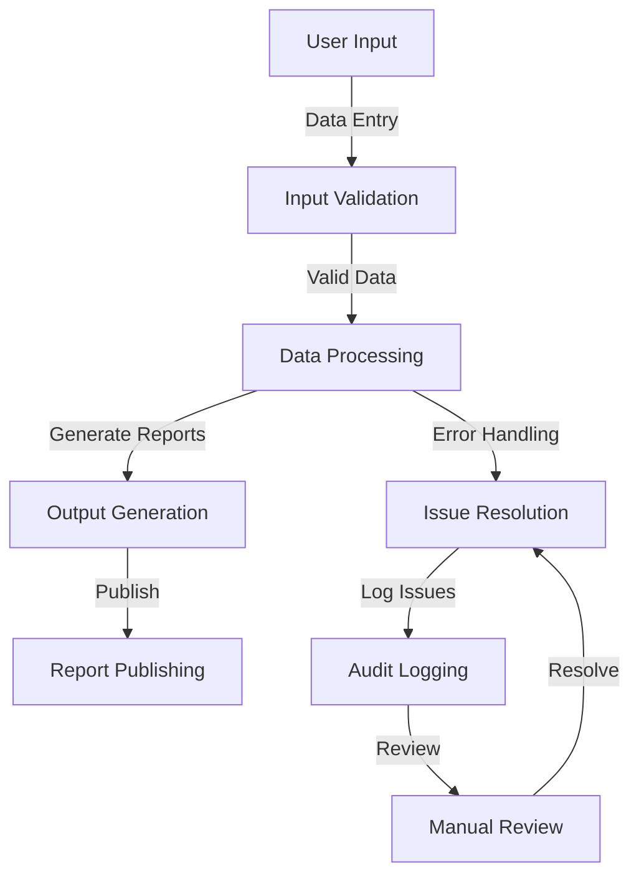

# WRRL Admin Suite Process Flow

```mermaid
graph TD
    A[User Input] -->|Data Entry| B[Input Validation]
    B -->|Valid Data| C[Data Processing]
    C -->|Generate Reports| D[Output Generation]
    D -->|Publish| E[Report Publishing]
    C -->|Error Handling| F[Issue Resolution]
    F -->|Log Issues| G[Audit Logging]
    G -->|Review| H[Manual Review]
    H -->|Resolve| F
```
